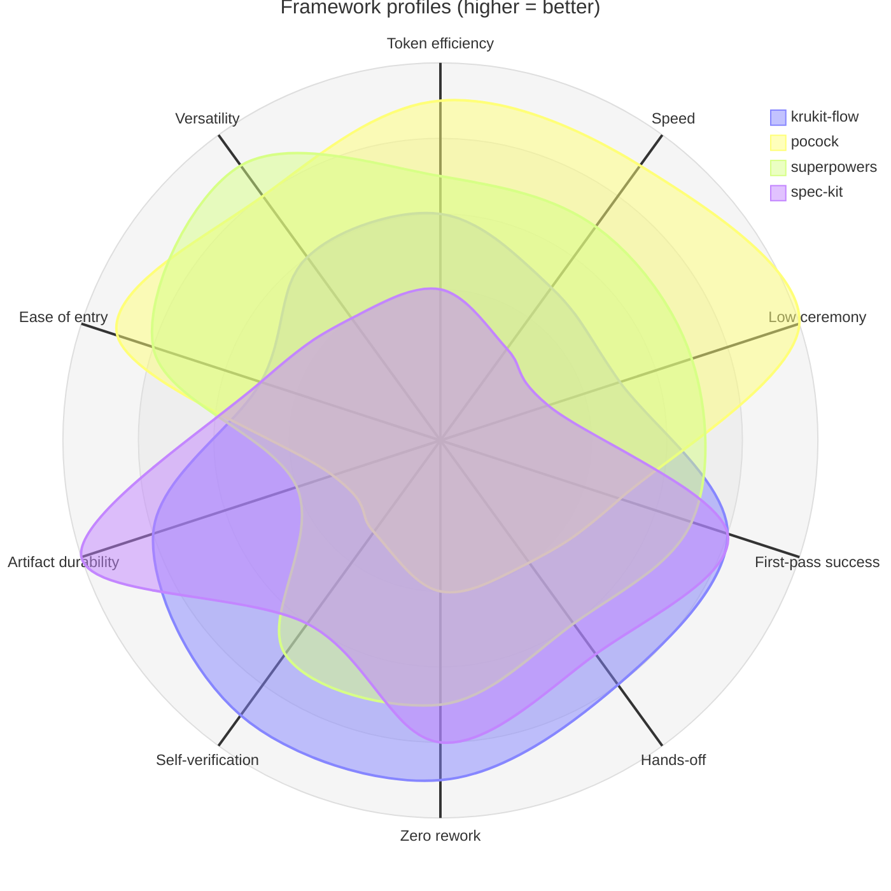

# Krukit

A disciplined, brownfield-first feature pipeline for Claude Code: **recon → grill → design → plan → act → verify → review**, orchestrated end-to-end by `/krukit-flow` with stage gates, lossless resume, a living project constitution, and a trace-driven self-improvement loop.

> **Status: early public release.** Built and used daily by the author; rough edges expected — feedback is the point. See `ROADMAP.md`.

## What it is

`krukit-flow` routes a task (trivial / fix / full / external-spec), then runs the stage skills in order — enforcing each stage's gate, recording state in `flow-state.md`, and supporting resume and per-stage skips. The orchestrator and the recon stage are original; the connective tissue (constitution, reopen-rule, verbatim gate-evidence, trace-driven `krukit-improve`) is what differentiates it from a plain command chain.

The design was hardened against **12 validated pain points** mined from the GitHub issue trackers of six competing workflow tools (spec-kit, superpowers, OpenSpec, BMAD, Taskmaster, GSD) — e.g. the #1 cross-tool pain (one-way pipeline with no sanctioned backward path) is addressed by the reopen rule.

## How it compares

Author's calibrated judgment from daily use of all four frameworks — not telemetry (no framework publishes head-to-head numbers; telemetry is on the roadmap). Scale 1-10, **higher is better on every axis**; negative metrics are inverted ("low ceremony" = low process overhead, "ease of entry" = shallow learning curve).



The point is not "which is best" — the contours have different *shapes*, not different sizes. Each framework optimizes for a different price of error. Krukit's bet: buy self-verification and zero-rework with ceremony, then use routing to avoid paying that ceremony on small tasks.

## Install

```bash
git clone https://github.com/Todmy/krukit-flow
cp -r krukit-flow/skills/* ~/.claude/skills/
```

Restart Claude Code, then run `/krukit-flow` on any feature task. The router will size the pipeline to the task — small changes stay small.

## Skills

| Skill | Role |
|---|---|
| `krukit-flow` | Stage 0 — orchestrator |
| `krukit-recon` | Stage 1 — map the existing code before design |
| `krukit-grill` | Stage 2 — interrogate the idea against recon + domain model |
| `krukit-design` | Stage 3 — design doc + constitution check |
| `krukit-plan` | Stage 4 — bite-sized TDD implementation plan |
| `krukit-act` | Stage 5 — implement task-by-task with TDD |
| `krukit-verify` | Stage 6 — evidence-based verification + reality-check |
| `krukit-review` | Stage 7 — fresh-eyes review + branch finish |
| `krukit-rules` | Companion — living project constitution |
| `krukit-improve` | Companion — trace-driven skill improvement |
| `krukit-discovery` | Companion — pre-flow problem-space interrogation |

## Prior art & credit

Krukit exists because of tools I used heavily and genuinely rate:

- **[Spec Kit](https://github.com/github/spec-kit)** (GitHub) — spec-driven development done properly: write the spec down first, treat it as the deliverable.
- **[superpowers](https://github.com/obra/superpowers)** by Jesse Vincent — a deep, composable library of engineering-discipline skills: brainstorming, TDD, systematic debugging, verification, code review.
- **[Matt Pocock's skills](https://github.com/mattpocock/skills)** — sharp interrogation methodology (grill-with-docs) for pressure-testing a plan before you build it.

All three are excellent and worth your time. I ran real features through them, then went and read what people actually complain about in their issue trackers — and tried to build something **simpler to use, clearer to follow, and lighter to run**, while keeping the discipline that makes those tools good.

### What people keep running into

Pains validated across the issue trackers of six workflow tools (Spec Kit, superpowers, OpenSpec, BMAD, Taskmaster, GSD):

- **One-way pipeline.** Once you're implementing, there's no sanctioned way back when the work proves the design wrong. The single most-reacted pain across every tool.
- **No grounding in the existing code.** Specs and clarifying questions get written without reading the repo, so brownfield assumptions slip straight through to implementation.
- **Capped, code-blind clarification.** A fixed question limit, and no look at the actual source behind the answers.
- **No feedback loop.** Artifacts freeze at planning time; what you learn while building never flows back into the design.
- **Silent gate approvals.** "Did the user actually approve this?" gets answered by the model, not the user.

Krukit's takes: a brownfield recon pass *before* any design, a reopen rule so verification can send you back with the design and plan updated, gate approvals that require a real quoted user reply, and routing that keeps small changes small instead of forcing full ceremony.

## Feedback

This is an early release and your experience report is the most valuable thing you can give it. [Open an issue](https://github.com/Todmy/krukit-flow/issues) with:

- what broke or confused you,
- what felt heavier than it should,
- what you'd steal for your own workflow.

## License

MIT © 2026 Dmytro Tolok
